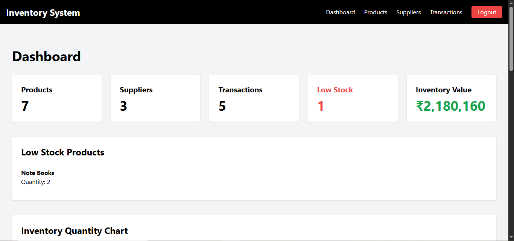
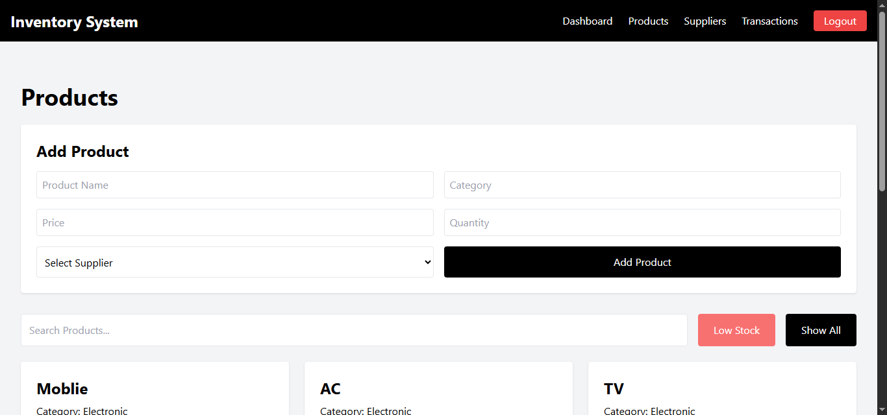
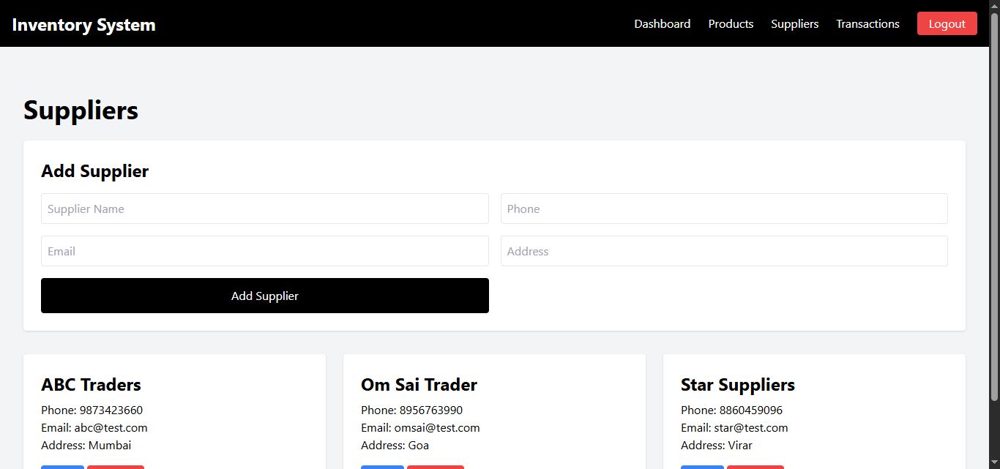
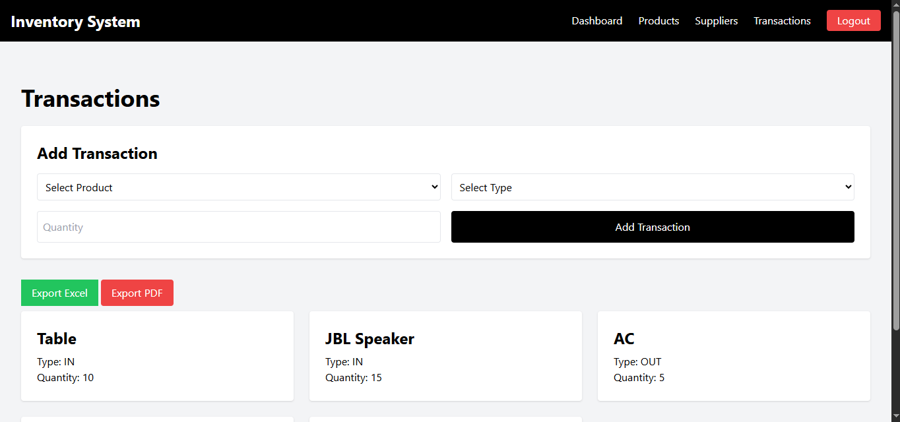

# Inventory Management System

A modern full-stack Inventory Management System designed to help businesses efficiently manage products, stock levels, suppliers, and inventory operations.

## Features

- JWT Authentication
- Dashboard Analytics
- Product Management (Add, Edit, Delete)
- Supplier Management
- Transaction Tracking
- Inventory Value Calculation
- Low Stock Monitoring
- Search and Filters
- Responsive Design
- Chart.js Dashboard Visualizations
- Excel Export
- PDF Export

## 🌐 Live Demo

```bash
https://inventory-management-system-nu-rose.vercel.app/
```

---

## 📸 Desktop Preview






---

## Tech Stack

### Frontend

- HTML
- Tailwind CSS
- JavaScript

### Backend

- Node.js
- Express.js

### Database

- MySQL

## Project Structure

```bash
inventory-management-system
│
├── backend
│   ├── config/
│   ├── controllers/
│   ├── middleware/
│   ├── routes/
│   ├── node_modules
│   ├── .env
│   ├── package.json
│   └── server.js
│
├── frontend
│    ├── js/
│    │   ├── auth.js
│    │   ├── config.js
│    │   ├── dashboard.js
│    │   ├── navbar.js
│    │   ├── products.js
│    │   ├── suppliers.js
│    │   ├── toast.js
│    │   └── transactions.js
│    │
│    ├── dashboard.html
│    ├── index.html
│    ├── products.html
│    ├── suppliers.html
│    └── transactions.html
│
├── preview/
│   ├── dashboard.png
│   ├── productspage.png
│   ├── supplierspage.png
│   └── transactionspage.png
│
├── README.md
├── LICENSE
├── CONTRIBUTING.md
└── .gitignore
```

## Installation

### Clone Repository

```bash
git clone https://github.com/darshanworks/inventory-management-system.git
```

### Navigate to Project Folder

```bash
cd inventory-management-system
```

### Install Dependencies

```bash
npm install
```

### Configure Environment Variables

Create a `.env` file in the root directory:

```env
PORT=5000

DB_HOST=localhost
DB_USER=root
DB_PASSWORD=your_password
DB_NAME=inventory_db

JWT_SECRET=your_secret_key
```

### Start Server

```bash
npm start
```

or

```bash
npm run dev
```

## Database Setup

Create a MySQL database:

```sql
CREATE DATABASE inventory_db;
```

## 📌 Future Improvements

- Dark Mode
- Pagination
- Email Notifications
- Cloud Deployment

## Author

Darshan Malagonvkar

## License

This project is licensed under the MIT License.
